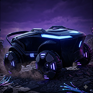
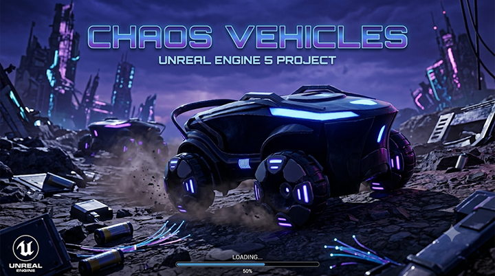

<div align="center">
  
</div>

<p align="center">
  
</p>

<h1 align="center">Chaos Vehicles</h1>

<p align="center">
  <b>A fully configured 4-wheel AWD automatic vehicle built from scratch in Unreal Engine 5.6 using the Chaos Vehicles Plugin</b>
</p>

<p align="center">
  
  
  
  
</p>

---

<p align="center">
  
</p>

---

## 📖 About

**Chaos Vehicles** is a blueprint-only Unreal Engine 5.6 project that demonstrates how to set up a fully functional **4-wheel All-Wheel-Drive (AWD) automatic transmission vehicle** using the **Chaos Vehicles Plugin** — UE5's physics-based vehicle simulation system built on the Chaos physics engine.

Everything in this project has been built from the ground up:

- 🚗 **Skeletal Mesh** — Generated manually from the static vehicle mesh
- 🦴 **Wheel Bones & Skinning** — Created and weighted by hand inside the project (no external DCC tools required for rigging)
- ⚙️ **Vehicle Physics** — Configured entirely through the Chaos Vehicle blueprint system with torque curves, suspension, and drivetrain settings
- 🎮 **Input System** — Full player controls using UE5's Enhanced Input system

---

## ✨ Features

| Feature | Details |
|---|---|
| **Drivetrain** | All-Wheel Drive (AWD) with automatic transmission |
| **Wheels** | Separate front and rear wheel blueprints with independent configurations |
| **Physics** | Full Chaos Vehicle physics with custom torque curve and physics asset |
| **Skeletal Mesh** | Hand-rigged from static mesh with manually placed wheel bones and skin weights |
| **Animation** | Animation Blueprint for wheel spin, steering rotation, and suspension movement |
| **Input** | Enhanced Input system with steering, throttle, brake, reverse, free-look camera, and handbrake |
| **Rendering** | Lumen GI, ray tracing, virtual shadow maps, SM6 shaders (DX12) |
| **Game Mode** | Custom vehicle game mode with auto-possession |

---

## 🎮 Controls

Both **keyboard + mouse** and **gamepad/controller** inputs are fully supported.

| Action | Keyboard | Controller | Description |
|---|---|---|---|
| **Throttle** | `W` | `Right Trigger (RT)` | Accelerate forward |
| **Brake / Reverse** | `S` | `Left Trigger (LT)` | Brake (or reverse when stopped) |
| **Steer** | `A` / `D` | `Left Stick X-Axis` | Turn wheels left / right |
| **Handbrake** | `Space` | `Left Face Special Button` | Engage handbrake / drift |
| **Free Look** | `Mouse` | `Right Stick (2D Axis)` | Look around the vehicle freely |

---

## 📁 Project Structure

```
ChaosVehicles/
├── ChaosVehicles.png                 # Project logo / icon
├── ChaosVehicles.uproject            # UE 5.6 project file
│
├── Config/
│   ├── DefaultEngine.ini             # Renderer, Lumen, ray tracing, DX12 settings
│   ├── DefaultInput.ini              # Enhanced Input configuration
│   ├── DefaultGame.ini               # Game settings
│   └── DefaultEditor.ini             # Editor preferences
│
└── Content/
    ├── Blueprints/
    │   ├── Vehicle/
    │   │   ├── BP_Vehicle             # Main vehicle pawn blueprint
    │   │   ├── BP_FrontWheel          # Front wheel configuration (ChaosVehicleWheel)
    │   │   ├── BP_RearWheel           # Rear wheel configuration (ChaosVehicleWheel)
    │   │   └── ABP_Vehicle            # Animation Blueprint for wheel/suspension
    │   └── Game/
    │       └── BP_VehicleGameMode     # Custom game mode
    │
    ├── Input/
    │   ├── IMC_Vehicle                # Input Mapping Context
    │   ├── IA_Throttle                # Input Action — Throttle
    │   ├── IA_Steer                   # Input Action — Steering
    │   ├── IA_BrakeAndReverse         # Input Action — Brake / Reverse
    │   ├── IA_HandBrake               # Input Action — Handbrake
    │   └── IA_Look                    # Input Action — Free Look Camera
    │
    ├── Mesh/
    │   ├── Vehicle/
    │   │   ├── SM_Vehicle             # Static mesh — Full vehicle body
    │   │   ├── SM_Chasis              # Static mesh — Chassis
    │   │   └── SM_Wheel               # Static mesh — Wheel
    │   └── Geometery/
    │       └── Cylinder_E07F3B1E      # Helper geometry
    │
    ├── Skeleton/
    │   └── Vehicle/
    │       ├── SKM_Vehicle            # Skeletal mesh (generated from static mesh)
    │       ├── SKEL_Vehicle           # Skeleton asset with wheel bones
    │       └── SM_Vehicle             # Static mesh reference
    │
    ├── Physics/
    │   ├── PHYS_Vehicle               # Physics asset for vehicle collision & simulation
    │   └── CF_Torque                  # Torque curve float asset for engine tuning
    │
    ├── Textures/
    │   └── Vehicle/
    │       ├── M_ScifiTruck           # Vehicle body material
    │       ├── M_Wheels               # Wheel material
    │       ├── T_ScifiTruck_DIF       # Diffuse / Albedo texture
    │       ├── T_ScifiTruck_NRM       # Normal map
    │       ├── T_ScifiTruck_ORM       # Occlusion / Roughness / Metallic packed texture
    │       └── T_ScifiTruck_EM        # Emissive texture
    │
    ├── Splash/
    │   ├── Splash.png                 # Game splash screen
    │   └── EdSplash.png               # Editor splash screen
    │
    └── Maps/
        ├── TestingMap                 # Primary test level (default map)
        └── TestMap                    # Secondary test level
```

---

## 🔧 Technical Highlights

### Chaos Vehicle Setup

The vehicle is configured as a **`WheeledVehiclePawn`** using the Chaos Vehicles Plugin with the following key components:

- **`BP_Vehicle`** — The main vehicle pawn containing the skeletal mesh component, spring arm camera, and the Chaos Vehicle Movement Component
- **`BP_FrontWheel`** / **`BP_RearWheel`** — Derived from `ChaosVehicleWheel`, these define per-axle properties such as:
  - Wheel radius & width
  - Suspension stiffness & damping
  - Friction force multiplier
  - Steering angle (front wheels only)
- **`PHYS_Vehicle`** — Physics Asset defining collision bodies for the chassis and each wheel bone
- **`CF_Torque`** — Float Curve asset defining the engine's torque output across the RPM range

### Skeletal Mesh Pipeline (Done In-Editor)

1. Started with the static mesh `SM_Vehicle`
2. Created a Skeleton (`SKEL_Vehicle`) with a root bone and four wheel bones positioned at each wheel location
3. Generated the Skeletal Mesh (`SKM_Vehicle`) from the static mesh
4. Manually painted skin weights to bind the wheel geometry to their respective bones
5. Created `ABP_Vehicle` (Animation Blueprint) to drive wheel rotation, steering, and suspension offsets at runtime

### Rendering Configuration

| Setting | Value |
|---|---|
| Global Illumination | Lumen (Dynamic GI) |
| Reflections | Lumen Reflections |
| Shadows | Virtual Shadow Maps |
| Ray Tracing | Enabled |
| Shader Model | SM6 (DX12) |
| Static Lighting | Disabled (fully dynamic) |

---

## 🚀 Getting Started

### Prerequisites

- **Unreal Engine 5.6** (installed via the Epic Games Launcher)
- **Windows** with a DX12-capable GPU (ray tracing-capable GPU recommended)
- **Chaos Vehicles Plugin** enabled (included by default in UE5, explicitly enabled in this project)

### Setup

1. **Clone the repository**
   ```bash
   git clone https://github.com/your-username/ChaosVehicles.git
   ```

2. **Open the project**
   - Double-click `ChaosVehicles.uproject`, or
   - Open it via the Unreal Engine launcher

3. **Play**
   - The project opens to `TestingMap` by default
   - Hit **Play** (Alt+P) — the vehicle pawn is auto-possessed
   - Use **WASD** + **Mouse** to drive around

---

## 🔌 Plugins Used

| Plugin | Purpose |
|---|---|
| **ChaosVehiclesPlugin** | Core vehicle physics simulation (Chaos-based wheeled vehicle system) |
| **ModelingToolsEditorMode** | Used during development for mesh editing and geometry operations |

---

## 📜 License

This project is provided for **educational and reference purposes**. Feel free to use it as a starting point for your own Chaos Vehicle implementations in UE5.

---

<p align="center">
  
  <br/>

</p>

<div align="center">
  
</div>
